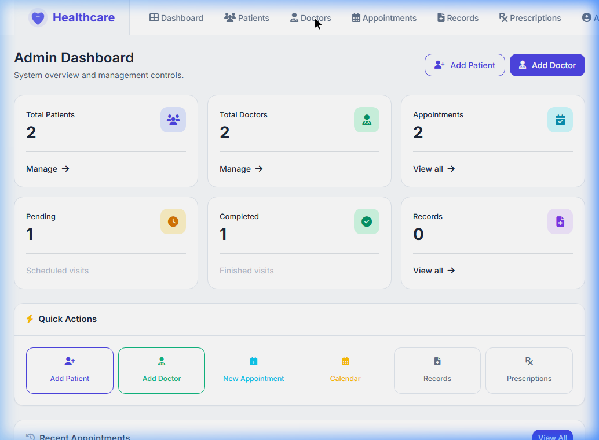
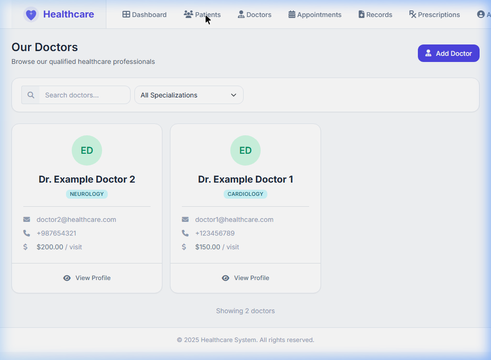
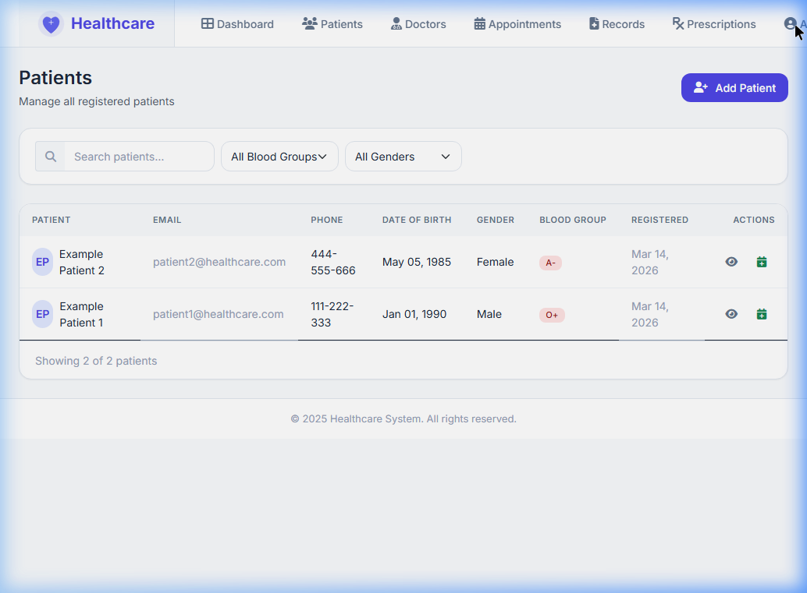

# 🏥 Healthcare Management System

A modern, full-featured healthcare management system built with ASP.NET Core MVC. This application provides a comprehensive solution for managing patients, doctors, appointments, medical records, and prescriptions.


### Application Walkthrough


## Features

### Multi-Role Authentication
- **Admin** - Full system access and management
- **Doctor** - Patient management, appointments, prescriptions
- **Patient** - Book appointments, view records and prescriptions

### Core Modules

| Module | Description |
|--------|-------------|
| **Patient Management** | Register patients, manage profiles, track medical history |
| **Doctor Management** | Add doctors, specializations, consultation fees |
| **Appointment System** | Book, reschedule, cancel appointments with calendar view |
| **Medical Records** | Create and manage patient medical records |
| **Prescriptions** | Digital prescriptions with print support |

###  Modern UI/UX
- Clean, minimal, and professional design
- Responsive dashboard for all user roles
- Real-time statistics and data visualization
- Mobile-friendly interface

## Tech Stack

- **Backend:** ASP.NET Core 8.0 MVC
- **Database:** Entity Framework Core with SQL Server
- **Frontend:** Bootstrap 5, Font Awesome, Inter Font
- **Authentication:** Session-based authentication

## Getting Started

### Prerequisites

- [.NET 8.0 SDK](https://dotnet.microsoft.com/download/dotnet/8.0)
- [SQL Server](https://www.microsoft.com/sql-server) (or SQL Server Express/LocalDB)

### Installation

1. **Clone the repository**
   ```bash
   git clone https://github.com/MazenMahmoud21/HealthCare.git
   cd HealthCare
   ```

2. **Restore dependencies**
   ```bash
   dotnet restore
   ```

3. **Update database connection string**
   
   Edit `appsettings.json` with your SQL Server connection string:
   ```json
   {
     "ConnectionStrings": {
       "DefaultConnection": "Server=YOUR_SERVER;Database=HealthcareDB;Trusted_Connection=True;"
     }
   }
   ```

4. **Apply database migrations**
   ```bash
   dotnet ef database update
   ```

5. **Run the application**
   ```bash
   dotnet run
   ```

6. **Open in browser**
   ```
   http://localhost:5049
   ```

## 🎥 Presentation

- Google Drive: https://drive.google.com/file/d/1-EcKY9ZqXjNRJrl8OR0lBEwXjDp0R6iL/view?usp=sharing

## 📸 Screenshots & Demo

### Login

*User authentication screen*

### Admin Dashboard

*Admin panel with system statistics and user management*

### Doctor Directory

*List of all doctors with specializations and fees*

### Patient List

*Patient health overview and management*

## 📁 Project Structure

```
HealthCare/
├── Controllers/          # MVC Controllers
│   ├── AccountController.cs
│   ├── AppointmentController.cs
│   ├── DoctorController.cs
│   ├── PatientController.cs
│   └── ...
├── Models/               # Data Models & DTOs
│   ├── Patient.cs
│   ├── Doctor.cs
│   ├── Appointment.cs
│   └── DTOs/
├── Views/                # Razor Views
│   ├── Account/
│   ├── Appointment/
│   ├── Doctor/
│   ├── Patient/
│   └── Shared/
├── Data/                 # Database Context
├── wwwroot/              # Static Files (CSS, JS)
└── Program.cs            # Application Entry Point
```

## Default Roles

| Role | Access Level |
|------|--------------|
| Admin | Full access - manage all users, doctors, patients, appointments |
| Doctor | View patients, manage appointments, create prescriptions & records |
| Patient | Book appointments, view own records and prescriptions |

##  Author

- GitHub: [@MazenMahmoud21](https://github.com/MazenMahmoud21)
- GitHub: [@Hazem-esam](https://github.com/Hazem-esam)

---

<p align="center">
  Made with ❤️
</p>
